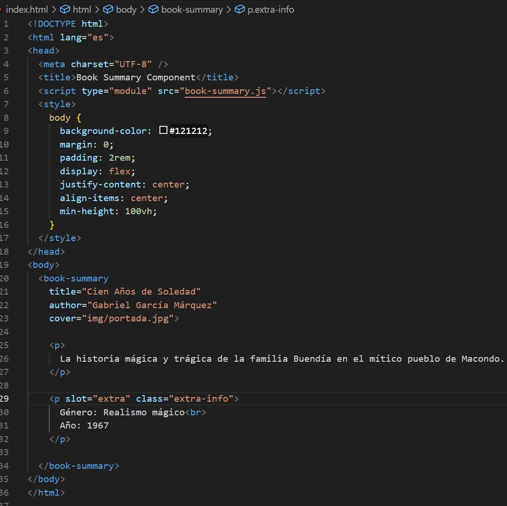
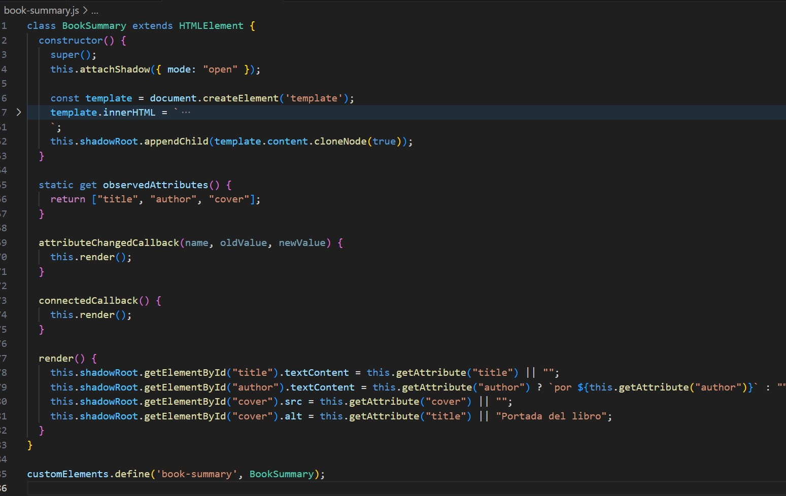
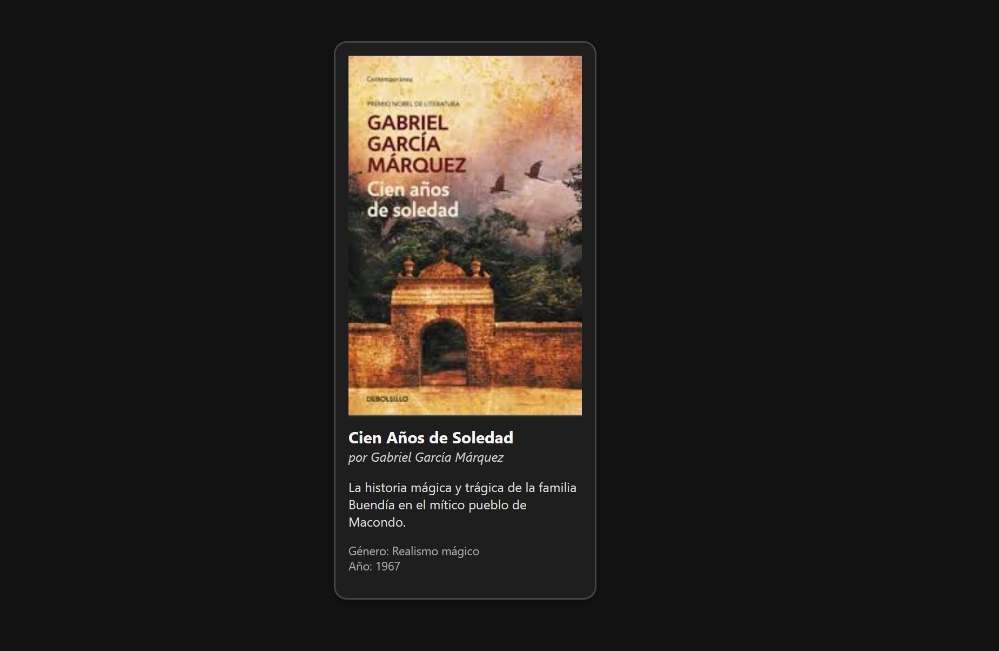

# Web Component: `<book-summary>`

Es un componente web personalizado llamado `<book-summary>` diseñado para mostrar información resumida de un libro: portada, título, autor, sinopsis, género y año. Es completamente reutilizable mediante atributos y slots ademas está encapsulado usando Shadow DOM.

---

## Objetivo

Mostrar un resumen de un libro de forma reutilizable y visualmente clara, ideal para páginas web educativas, librerías digitales o bibliotecas virtuales.

---

## 🔧 Funcionamiento del componente

El componente está formado por dos archivos clave:

---

### 1. `index.html` — Código de integración

Contiene el uso del componente y los datos dinámicos por atributos y slots.

**Captura del código HTML:**



---

###  2. `book-summary.js` — Lógica del Web Component

Define la clase personalizada extendiendo `HTMLElement`, con atributos observables, `slot`, `template` y Shadow DOM.

**Captura del código JavaScript:**



---

### Vista del componente ejecutándose

Este es el resultado visible del componente una vez cargado en el navegador:

**Captura de ejecución en navegador:**



---
### Repositorio de Git

[Link de repositorio en Gihub ](https://github.com/GiovannyGuso/book-summary-Duran-Giovanny.git)

## Atributos personalizados

| Atributo | Descripción                       | Ejemplo                               |
|----------|-----------------------------------|----------------------------------------|
| `title`  | Título del libro                  | `title="Cien Años de Soledad"`        |
| `author` | Autor del libro                   | `author="Gabriel García Márquez"`     |
| `cover`  | Imagen de portada del libro       | `cover="img/cien-anos.jpg"`           |

---

## Slots utilizados

- `<slot>`: Para insertar la sinopsis o descripción.
- `<slot name="extra">`: Para información adicional como género o año.

---

## Ejemplo de reutilización

```html
<book-summary 
  title="Las Cruces sobre el Agua" 
  author="Joaquín Gallegos Lara" 
  cover="img/las-cruces.jpg">
  <p>
    Una novela emblemática de la narrativa social ecuatoriana que narra los hechos trágicos de la masacre obrera de 1922 en Guayaquil, destacando la lucha y la injusticia vivida por la clase trabajadora.
  </p>
  <p slot="extra" class="extra-info">
    Género: Novela histórica-social<br>
    Año: 1946
  </p>
</book-summary>
